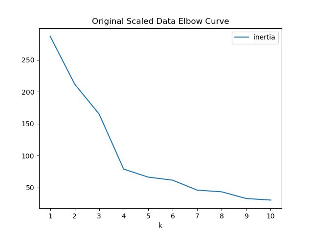
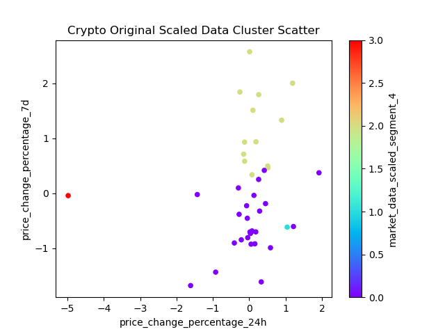
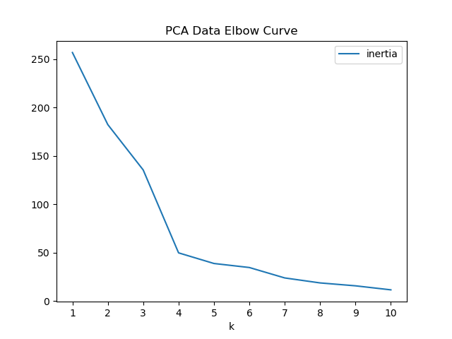
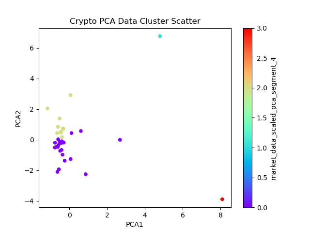

# CryptoClustering
Week 11 Challenge

# Functionality:
This application clusters crypto currencies according to their price fluctuations using the K-means algorithm and principal component analysis (PCA).

### Original Scaled Data Elbow Curve Method 
 

### Crypto Original Data Cluster Scatter Plot

### PCA Data Elbow Curve Method

### Crypto PCA Data Cluster Scatter Plot

# Approach:
The approach consisted of four steps.
1. Determine the best number of k values on the original scaled data using the elbow method.
2. Cluster the cryptocurrencies on the original scaled data using the K-Means model.
3. Perform principal component analysis to reduce the features to only three principal components.
4. Repeat the determination of the best number of k values on the three pincipal components using the elbow method.
5. Repeat the clustering of the crytocurrencies on the three principal components using the K-Means model.
6. Determine the weights for each principal component feature.

# Summary of Findings:
The data indicated the following findings:
1. The k values did not change from the original scaled data and the three principal component data. Both elbow methods optimized at four.
2. The total explained variance using the three principal components was 89.5%.
3. The price change for 200 days has the strongest positive influence on PCA1. The price change for 30 days has the strongest positive influence on PCA2. The price change for 7 days has the strongest positive influence on PCA3.

# Plagerism Statement:
No specific code was copied. In addition, this challenge required review of in-class work to understand syntax.
